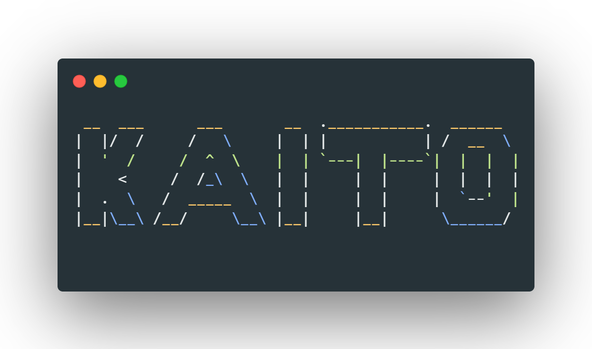

## KaitoBot
 
---
> **KaitoBot is Tencent-QQ bot written by Kaito. It is technically a "shortcut" for some Internet services.**  

###Inspired by a lot of other developers and projects below:

[Comet-Bot](https://github.com/StarWishsama/Comet-Bot) \
[Meme-Api](https://github.com/D3vd/Meme_Api) \
[gifencoder](https://github.com/square/gifencoder) \
[emojimix](https://github.com/Tikolu/emojimix) \
[NeteaseCloudMusicApi](https://github.com/Binaryify/NeteaseCloudMusicApi)

This program is powered by High-performance QQ bot framework [Mirai](https://github.com/mamoe/mirai)  \
and is licensed under [AGPLv3](https://github.com/Ishikawa-Kaito/KaitoBot/blob/master/LICENSE)
------

    Copyright (C) 2021-2022 Ishikawa_Kaito
    
    This program is free software: you can redistribute it and/or modify
    it under the terms of the GNU Affero General Public License as
    published by the Free Software Foundation, either version 3 of the
    License, or (at your option) any later version.
    
    This program is distributed in the hope that it will be useful,
    but WITHOUT ANY WARRANTY; without even the implied warranty of
    MERCHANTABILITY or FITNESS FOR A PARTICULAR PURPOSE.  See the
    GNU Affero General Public License for more details.
    
    You should have received a copy of the GNU Affero General Public License
    along with this program.  If not, see <http://www.gnu.org/licenses/>.
